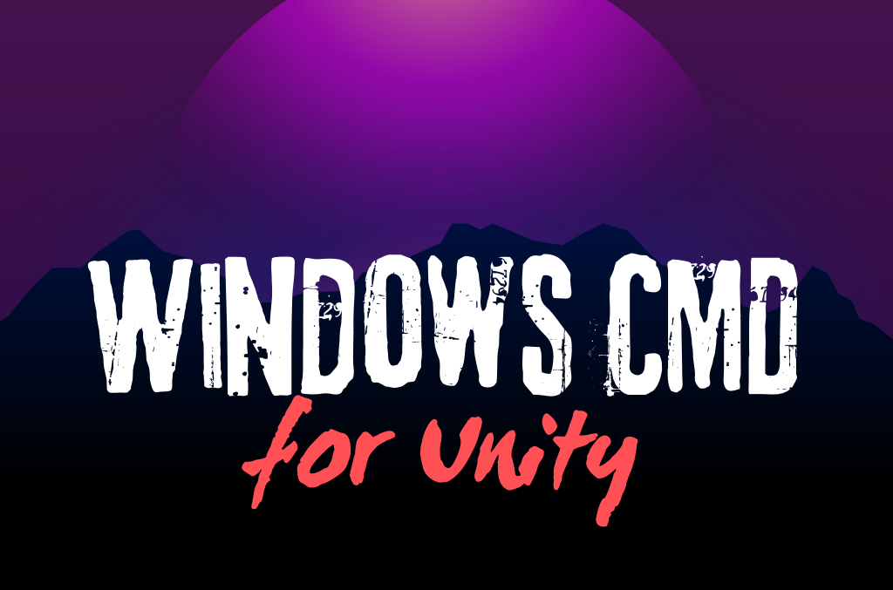

 


# Unity Geliştiricileri İçin Kullanışlı Windows Komutları 

## Amaç
Bu dokümanın amacı, Unity geliştiricilerine yönelik olarak Windows işletim sisteminde sıkça kullanılan ve geliştirme sürecini optimize edebilecek komutları kapsamlı bir şekilde sunmaktır. Bu kaynak, geliştiricilerin proje yönetimi, performans izleme ve sistem yapılandırması gibi alanlarda verimliliklerini artırmalarına yardımcı olmayı hedeflemektedir.

## İçerik
|Sıra|Komut|Açıklama|Aileye Ait|
|:---:|:---:|:---:|:---:|
| 1 | [`cd`](#cd-komutu) | Klasörler arasında geçiş yapabiliyoruz. | `cd`, `cd..`, `cd.`, `cd /`|
| 2 | [`mkdir`](#mkdir-komutu) | Klasör oluşturabiliyoruz. | `mkdir` |
| 3 | [`dir`](#dir-komutu) | Klasörlerde bulunan dosyaları ve klasörleri görebiliyoruz. | `dir`, `dir /a`, `dir /a-d`, `dir /a-h` |
| 4 | [`copy`](#copy-komutu) | Dosyaları istediğimiz konuma kopyalayabiliyoruz. | `copy` |
| 5 | [`move`](#move-komutu) | Dosyayı istediğimiz yere taşıyabiliyoruz. | `move` |
| 6 | [`ipconfig`](#ipconfig-komutu) | TCP/IP ağ yapılandırma değerlerini gösterir. | `ipconfig` |
| 7 | [`del`](#del-komutu) | Belirtilen yoldaki dosyayı siler. | `del` |
| 8 | [`tasklist`](#tasklist-komutu) | Çalışan işlemleri gösterir. | `tasklist` |
| 9 | [`taskkill`](#taskkill-komutu) | Çalışan bir işlemi sonlandırır. | `taskkill /im`, `taskkill /f /im`, `taskkill /f /im /t`, `taskkill /f /pid /t` |
| 10 | [`ping`](#ping-komutu) | Belirli bir sunucuya bağlanma ve yanıt alma durumlarını kontrol eder. | `ping`, `ping -t`, `ping -n` |
| 11 | [`systeminfo`](#systeminfo-komutu) | Bilgisayarın bilgilerini görüntüler. | `systeminfo`, `systeminfo /fo csv`, `systeminfo /fo list` |
| 12 | [`tree`](#tree-komutu) | Bir dizinin yapısını görsel olarak gösterir. | `tree`, `tree /f`, `tree /a`, `tree /a /f` |
| 13 | [`perfmon /report`](#perfmon-report-komutu) | Performans izleyicisini açar. | `perfmon /report` |
| 14 | [`nvidia-smi`](#nvidia-smi-komutu) | NVIDIA grafik kartının performansını ve kullanım oranını gösterir. | `nvidia-smi` |
| 15 | [`type`](#type-komutu) | Bir dosya veya metin dosyasının içeriğini gösterir. | `type` |
| 16 | [`findstr`](#findstr-komutu) | Bir dosyada belirtilen kelimeyi bulur. | `findstr` |
| 17 | [`driverquery`](#driverquery-komutu) | Yüklü olan sürücülerin listesini görüntüler. | `driverquery`, `driverquery /v`, `driverquery /fo csv`, `driverquery /si` |
| 18 | [`getmac`](#getmac-komutu) | MAC adresini görüntüler. | `getmac`, `getmac /fo table /nh /v` |
| 19 | [`powercfg`](#powercfg-komutu) | Performans ve güç ayarlarını yönetir. | `powercfg`, ``powercfg /a``, ``powercfg /batteryreport`` |
| 20 | [`xcopy /s /i`](#xcopy-s-i-dosya_yol-dosya_yol-komutu)| Büyük boyuttaki dosya ve dizileri kopyalar. | `xcopy /s /i` |
| 21 | [`wmic`](#wmic-komutu) | Sistem yönetimi ve bilgi toplamak için kullanılan gelişmiş bir komut. | `wmic computersystem get model,name,manufacturer,systemtype`, `wmic cpu get name,numberofcores,maxclockspeed`, `wmic memorychip get capacity,speed`, `wmic diskdrive get model,size,status`, `wmic os get caption,version,osarchitecture`, `wmic path win32_VideoController get name,adapterram,driverversion`, `wmic process where "name like '%Unity%'" get name,processid,commandline`, `wmic cpu get loadpercentage`, `wmic memorychip get capacity`, `wmic process call create "C:\Program Files\Unity\Hub\Editor\2021.3.0f1\Editor\Unity.exe -projectPath C:\UnityProjects\MyGame -batchmode -quit -logFile C:\buildlog.txt -buildWindows64Player C:\Builds\MyGame.exe"` |
| 22 | [`sc queryex type=service state=all`](#sc-queryex-typeservice-stateall-komutu) | Servisleri listelemeye yarar. | `sc queryex type=service state=all`, `sc queryex type=service state=all \| findstr "RUNNING"` |
| 23 | [`wevtutil qe Application /c:10 /f:text`](#wevtutil-qe-application-c10-ftext-komutu) | Uygulama olaylarını takip etmekte kullanışlıdır. | `wevtutil qe Application /c:10 /f:text`, `wevtutil qe Application /c:10 /f:text \| findstr "Unity"`, `wevtutil qe Application /c:10 /f:text \| findstr "Unity" /v` |
| 24 | [`netsh wlan show interfaces`](#netsh-wlan-show-interfaces-komutu) | Ağlara bakmak için kullanılır. | `netsh wlan show interfaces`, `netsh wlan show interfaces \| findstr "SSID"`, `netsh wlan show interfaces \| findstr "SSID" /v` |
| 25 | [`nslookup`](#nslookup-komutu) | Belirli bir yerin IP adresini bulur. | `nslookup` |
| 26 | [`tracert`](#tracert-komutu) | Ağlara bakmak için kullanışlıdır. | `tracert`, `tracert \| findstr "192.168.1"` |
| 27 | [`echo`](#echo-komutu) | Metin yazdırmak için kullanılır. | `echo` |
| 28 | [`schtasks`](#schtasks-komutu) | Belirli görevleri otomotikleştiriyor. | `schtasks`, `schtasks \| findstr "Unity"`, `schtasks /query`, `schtasks /query /fo csv`, `schtasks /create /tn "Görev Adı" /tr "Görev Komutu" /sc schedule_type /st start_time /sd start_date`, `schtasks /run /tn "Görev Adı"`, `schtasks /delete /tn "Görev Adı"`, `schtasks /change /tn "Görev Adı" /tr "Görev Komutu"` |
| 29 | [`exit`](#exit-komutu) | Komutları sonlandırır ve terminali kapatır. | `exit` |
| 30 | [`for`](#for-komutu) | Döngü oluşturmakta kullanışlıdır. | `for %i in (*.txt) do echo %i`, `for %i in ("Hedef_Dizin\*.txt") do copy "%i" "Taşınacak_Dizin"`, `for %i in ("C:\Users\EnesEfeTokta\Desktop\*.txt") do move "%i" "C:\Users\EnesEfeTokta\Desktop\Dizin_adi"`, `for %i in ("C:\Users\EnesEfeTokta\Desktop\*.txt") do del "%i"` |
| 31 | [`diskpart`](#diskpart-komutları) | Disk üzerinde çalışılmasını sağlar. | `diskpart`, `list disk`, `select disk x`, `list partition`, `create partition primary`, `format fs=ntfs quick` |

## Uyarılar
Lütfen bu komutları kendi cihazınızda test ederken dikkatli olununuz. Bazı komutlar cihazınızda ki verilerinizi bozabilir, değiştirebilir veya silebilir. Her hangi bir olumsuz durumda mesuliyet kabul edilmiyor. Bir sorunla karşılaşırsanız, Microsoft'dan yardım alabilirsiniz.

## `cd` Komutu 
`cd` komutu ile klasörler arasında geçiş yapabiliyoruz. Unity geliştiricileri proje dizinleri arasında gezintiler yapabilirler. Bu komutun işlevleri şu şekildedir:
*  `cd` komutu ile ilgili klasöre geçiş yapılır.
   ```dos   
   cd <klasör_adı>
   ```
   

* `cd..` komutu ile bir üst klasörü geçiş yapabiliyoruz. 
   ```dos
   cd..
   ```

   

* `cd.` komutu ile bulunduğumuz klasörü gidebiliyoruz.
   ```dos
   cd.
   ```
   

* `cd /` komutu ile C: klasörüne gidebiliyoruz.
   ```dos
   cd /
   ```
    

## `mkdir` Komutu  
Unity projelerinde dosya ve klasör yapısının düzenli olması önemlidir. `mkdir` komutu, komut satırından yeni klasörler oluşturmanıza olanak tanır ve proje dosyalarınızı düzenlerken size hız kazandırır. Özellikle sürüm kontrol sistemleri kullanırken ya da projeyi ilk oluşturma aşamasında klasörleri hazırlarken faydalıdır.

Aşağıdaki gibi temel bir `mkdir` komutu ile hızlıca klasör oluşturabilirsiniz:

```dos
mkdir <klasör_adı>
```


## `dir` Komutu  
`dir` komutu, klasörlerde bulunan dosya ve klasörleri listelemek için kullanılır. Unity projelerinde dosya yapısını hızlıca kontrol etmek veya sistem ve gizli dosyalar gibi belirli dosya türlerini incelemek için özellikle faydalıdır. `dir` komutunun çeşitli seçenekleri ile dizinlerde hızlı gezinme ve belirli dosyaları listeleme işlemlerini detaylandırabilirsiniz.

### `dir` Komutunun Temel Kullanımı
`dir`: Bu, en temel dir komutudur ve mevcut dizindeki dosyalar ve klasörleri listeler. Gizli veya sistem dosyalarını göstermez.

```dos
dir
```


### `dir` Komutunun Farklı Seçenekleri
* `dir /a`, gizli dosyalar ve sistem dosyaları dahil olmak üzere mevcut dizindeki tüm dosyaları ve klasörleri listeler. Unity projelerinde gizli veya sistem dosyalarını görmek, proje içinde görünmeyen dosyaları bulmak için kullanışlıdır.
   ```dos
   dir /a
   ```
   

* `dir /a-d`, yalnızca dosyaları listeler ve klasörleri göstermez. Klasörleri hariç tutarak sadece dosya listesi elde etmeniz gerekiyorsa yararlıdır. Örneğin, Assets klasörünüzde yalnızca dosyaları listelemek istiyorsanız kullanabilirsiniz.
   ```dos
   dir /a-d
   ```
   

* `dir /a-h` komutu, gizli olmayan tüm dosyaları ve klasörleri gösterir. Bu komut, yalnızca görünür dosyaları görmek ve gizli dosyaları dışarıda bırakmak istediğinizde işinize yarar. Unity projelerindeki belirli dosyaları görmek veya gizli dosyaları dışarıda bırakmak istediğinizde kullanabilirsiniz.
   ```dos
   dir /a-h
   ```
   

### Özetle `dir` Komutunun Unity Projelerinde Kullanımı
Bu komutlar, Unity projelerinde çeşitli durumlarda, örneğin gizli dosyaları kontrol etme, sadece dosya veya klasörleri listeleme ve proje yapısını hızlıca inceleme gibi durumlarda fayda sağlar. Komutlar, belirli parametrelerle kullanılarak ihtiyaca yönelik dizin görüntülemeleri sağlar.

## `copy` Komutu  
`copy` komutu ile dosyaları kopyalamak için kullanılır. Bu komutun kullanımı şu şekildedir:

```dos
copy <kaynak_dosya> <hedef_dosya>
```


## `move` Komutu  
`move` komutu ile dosyaları taşımak için kullanılır. Bu komutun kullanımı şu şekildedir:

```dos
move <kaynak_dosya> <hedef_dosya>
```


## `ipconfig` Komutu  
`ipconfig` komutu ile tüm geçerli TCP/IP ağ yapılandırma değerlerini görüntüler ve Dinamik Ana Bilgisayar Yapılandırma Protokolü (DHCP) ve Etki Alanı Adı Sistemi (DNS) ayarlarını yeniler. Parametreler olmadan kullanıldığında, ipconfig tüm bağdaştırıcılar için İnternet Protokolü sürüm 4 (IPv4) ve IPv6 adreslerini, alt ağ maskesini ve varsayılan ağ geçidini görüntüler.

```dos
ipconfig
```

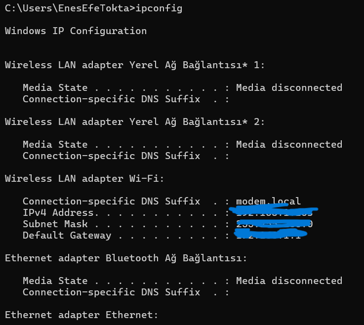

## `del` Komutu  
`del` komutu ile belitririlen dosya silinir. Bu komutun kullanımı şu şekildedir:

```dos
del <kaynak_yol>
```


## `tasklist` Komutu  
`tasklist` komutu ile bilgisayarda çalışan sistemleri listeler.

```dos
tasklist
```


## `taskkill` Komutu  
`taskkill` komutu, Windows işletim sisteminde çalışan işlemleri (processes) sonlandırmak için kullanılır. Özellikle yanıt vermeyen programları kapatmak veya belirli işlemleri hızlıca sonlandırmak istediğinizde bu komut oldukça faydalıdır. Aşağıda `taskkill` komutunun çeşitli kullanım örnekleri ve Unity geliştirme sürecinde nasıl yararlı olabileceği açıklanmaktadır.

### `taskkill` Komutunun Kullanım Şekilleri 
* `taskkill /im <process_name>`: Bu komut, belirtilen işlem adını kullanarak işlemi nazikçe sonlandırmaya çalışır. Normal bir kapatma işlemidir. Unity veya başka bir yazılımda hafif sorunlarla karşılaştığınızda kullanabilirsiniz.
   ```dos
   taskkill /im  Notepad.exe
   ```
   

* `taskkill /f /im <process_name>`: "/f" parametresi ("force") ile komut, işlemi zorla kapatır. İşlem, doğrudan sonlandırılır. Bu, yanıt vermeyen veya donmuş Unity uygulamalarını kapatmak için idealdir.
   ```dos
   taskkill /f /im chrome.exe
   ```
   

* `taskkill /f /im <process_name> /t`: "/t" parametresi ile birlikte, belirtilen işlem ve başlattığı tüm alt işlemler zorla kapatılır. Birden fazla işlemi sonlandırmak istediğinizde, özellikle Unity'nin dışa aktardığı alt süreçleri veya bağlı uygulamaları kapatmak için kullanışlıdır.
   ```dos
   taskkill /f /im  Notepad.exe /t
   ```
   

* `taskkill /f /pid <process_id> /t`: Belirli bir PID'ye (Process ID) sahip işlemi ve onun tüm alt işlemlerini zorla kapatır. PID'yi öğrenmek için "tasklist" komutunu kullanabilirsiniz. Test veya performans sorunlarında yalnızca belirli bir süreci sonlandırmak istediğinizde faydalıdır.
   ```dos
   taskkill /f /pid 1234 /t
   ```
   

    Not: `process_id` 'yi öğrenmek için, "tasklist" komutunu kullanabilirsiniz.

Bu komutlar, özellikle Unity geliştirme sürecinde yanıt vermeyen Unity uygulamalarını veya editörünü kapatmak, performans sorunlarına neden olan arka plan işlemlerini sonlandırmak veya test amaçlı olarak belirli işlemleri kontrollü bir şekilde kapatmak için kullanışlı olabilir.

Not: İşlemleri zorla kapatmak veri kaybına neden olabilir, bu nedenle dikkatli kullanılmalıdır.

## `ping` Komutu 
`ping` komutu, belirli bir sunucuya bağlantı kurarak yanıt alma durumunu ve ağ gecikmesini kontrol etmek için kullanılan temel bir ağ aracıdır. Bu komut, sunucunun erişilebilir olup olmadığını ve bağlantının ne kadar hızlı yanıt verdiğini ölçmeye yarar. Aşağıda `ping` komutunun çeşitli kullanım örnekleri verilmiştir:
* `ping <sunucu_adresi>`: Bu komut, belirtilen sunucuya bağlanma ve yanıt alma durumlarını kontrol eder
   ```dos
   ping www.google.com
   ```
   

* `ping <sunucu_adresi> -t`: Bu komut, belirtilen sunucuya bağlanma ve yanıt alma durumlarını kontrol eder ve her saniye bir kez yanıt alma durumunu kontrol eder.
   ```dos
   ping www.google.com -t
   ```
   

* `ping <sunucu_adresi> -n <saniye_sayisi>`: Bu komut, belirtilen sunucuya bağlanma ve yanıt alma durumlarını kontrol eder ve belirtilen saniye sayısı kadar yanıt alma durumunu kontrol eder.
   ```dos
   ping www.google.com -n 10
   ```
   

## `systeminfo` Komutu 
`systeminfo` komutu ile bilgisayarın bilgilerini görüntüler. Bu komutun kullanımı şu şekildedir:
* `systeminfo`: Bu komut, bilgisayarın işletim sistemi, işlemci, ana bilgisayar, kullanıcı, sürücü ve disk bilgisini, görüntüsü ve bağlantı bilgilerini görüntüler.
   ```dos
   systeminfo
   ```
   

* `systeminfo /fo csv`: Bu komut, bilgisayarın işletim sistemi, işlemci, ana bilgisayar, kullanıcı, sürücü ve disk bilgisini, csv (comma-separated values) biçiminde görüntüler.
   ```dos
   systeminfo /fo csv
   ```
   

* `systeminfo /fo list`: Bu komut, bilgisayarın işletim sistemi, işlemci, ana bilgisayar, kullanıcı, sürücü ve disk bilgisini, listeleri (table) biçiminde görüntüler.
   ```dos
   systeminfo /fo list
   ```
   

## `tree` Komutu 
`tree` komutu, bir dizinin hiyerarşik yapısını görselleştirmek için kullanılan basit ancak etkili bir Windows komutudur. Özellikle Unity projeleri gibi karmaşık dosya yapılarına sahip projelerde, klasör yapısını hızlıca anlamak veya dokümante etmek için oldukça faydalıdır. Aşağıda tree komutunun farklı kullanım şekilleri ve Unity geliştiricileri için örnekleri yer almaktadır.

### `tree` Komutunun Kullanım Şekilleri
* `tree <dizin_yolu>`: Bu temel komut, belirtilen dizinin alt dizinlerini ve klasör yapısını gösterir. Dosyaları göstermez.
   ```dos
   tree C:\UnityProjects\MyGame
   ```
   

* `tree <dizin_yolu> /f`: "/f" parametresi "files" (dosyalar) anlamına gelir. Bu komut, dizin yapısını gösterirken her klasördeki dosyaları da listeler.
   ```dos
   tree C:\UnityProjects\MyGame /f
   ```
   

    Not 1: Çıktının uzunluğu fazla olabilir. O yüzden dikkatli olun.
   
    Not 2: Çıktının uzunluğu fazla olduğu için ekranda ufak bir bir bölümü gösteridim.

* `tree <dizin_yolu> /a`: "/a" parametresi "ASCII" anlamına gelir. Bu komut, dizin yapısını gösterirken ASCII karakterleri kullanır. Bu, özellikle çıktıyı bir metin dosyasına yönlendirirken veya bazı konsolların grafik karakterleri düzgün göstermediği durumlarda faydalıdır.
   ```dos
   tree C:\UnityProjects\MyGame /a
   ```
   

    Not: Çıktının uzunluğu fazla olduğu için ekranda ufak bir bir bölümü gösteridim.

* `tree <dizin_yolu> /a /f`: Bu komut, ASCII karakterleri kullanarak hem dizin yapısını hem de dosyaları gösterir.
   ```dos
   tree C:\UnityProjects\MyGame /a /f
   ```
   

    Not: Çıktının uzunluğu fazla olduğu için ekranda ufak bir bir bölümü gösteridim.

### Unity Geliştiricileri İçin Kullanım Örnekleri

1. **Proje Yapısını Görmek:** Unity projesindeki ana klasörlerin genel yapısını incelemek için `tree C:\UnityProjects\MyGame\Assets`.

2. **Script Klasörünü İncelemek:** Kodların bulunduğu `Scripts` klasörünün hem yapısını hem de içindeki dosyaları listelemek için `tree C:\UnityProjects\MyGame\Assets\Scripts /f`.

3. **Prefab ve Sahne Dosyalarını Kontrol Etmek:** Prefab ve Scene dosyalarının yerleşimini aynı anda görmek için `tree C:\UnityProjects\MyGame\Assets\Prefabs C:\UnityProjects\MyGame\Assets\Scenes /f`.

4. **Proje Yapısını Dokümante Etmek:** Proje yapısını dokümante etmek ve bir metin dosyasına kaydetmek için `tree C:\UnityProjects\MyGame /a /f > project_structure.txt`.

Bu komut, özellikle büyük Unity projelerinde dosya organizasyonunu anlamak, proje yapısını dokümante etmek veya farklı projeler arasında yapı karşılaştırması yapmak için çok kullanışlıdır.

### Önemli Notlar
1) **Çıktının Uzunluğu:** Büyük projelerde `/f` parametresi ile alınan çıktılar çok uzun olabilir. Bu durumda sadece önemli klasörlerin analizini yapmak daha uygun olabilir.
2) **ASCII Kullanımı:** Farklı sistemlerde uyumluluk sorunları yaşamamak için `/a` parametresini tercih edebilirsiniz.
3) **Proje Organizasyonu:** Bu komut sayesinde dosya ve klasör düzeninizi kolayca analiz edebilir ve hatalı yapıları düzeltebilirsiniz.

## `perfmon /report` Komutu 
`perfmon /report` komutu, performans izleyicisini açar. Cihazın performansını ölçülmesine olanak sağlar.
```dos
perfmon /report
```


## `nvidia-smi` Komutu 
`nvidia-smi` komutu, NVIDIA grafik kartınız varsa, bu komut ile GPU'nuzun performansını, sıcaklığını ve kullanım oranını görebilirsiniz.

 Not: Bu komutun çalışması için NVIDIA grafik kartınızın olması gerekli.


## `type` Komutu 
 `type` komutu, bir dosya veya metin dosyasının içeriğini görmek için kullanılır. Bu komut, özellikle bir metin dosyasının içeriğini görmek için kullanışlıdır. İşte `tyepe` komutunun kullanım örneği:
 ```dos
 type C:\UnityProjects\MyGame\Assets\Scripts\MyScript.cs
 ```
 

 ## `findstr` Komutu 
 `findstr` komutu, bir dosyada belirtilen kelimeyi bulmak için kullanılır. Bu komut, özellikle metin dosyalarında arama yapmak için kullanışlıdır. İşte `findstr` komutunun kullanım örneği:
 ```dos
 findstr "Hello" C:\UnityProjects\MyGame\Assets\Scripts\MyScript.cs
 ```
 

## `driverquery` Komutu 
Windows işletim sisteminde yüklü sürücülerin durumunu görüntülemek için kullanılan `driverquery` komutu, sistemdeki donanım ve sürücülerle ilgili detaylı bilgi sağlar. Bu bilgi, özellikle Unity geliştiricileri gibi performans ve uyumluluk konularında hassas olan kullanıcılar için oldukça faydalıdır. Komut, sürücüler hakkında hızlı bir şekilde bilgi almayı mümkün kılar ve sorun tespiti ile çözüm için kritik bir araçtır.

### `driverquery` Komutunun Kullanım Şekilleri
Aşağıda, `driverquery` komutunun en yaygın kullanım örnekleri ve Unity geliştiricileri için pratik faydaları listelenmiştir.

* `driverquery`: Bu temel komut, sistemde yüklü olan tüm sürücülerin basit bir listesini gösterir.
   ```dos
   driverquery
   ```
   

   **Bu komut, sistemde yüklü olan tüm sürücülerin temel bir listesini görüntüler. Örnek çıktı:**
   | Modül Adı | Görüntüleme Yolu | Tip |
   | :---: | :---: | :---: |
   | NVIDIA | C:\Windows\System32\nvlddmkm.sys | Kernel |
   | Realtek Audio | C:\Windows\System32\RtkAPO.dll | Audio |

* `driverquery /v`: "/v" parametresi "verbose" (ayrıntılı) anlamına gelir. Bu komut, sürücüler hakkında daha detaylı bilgi sağlar, örneğin sürücü sağlayıcısı, sürücü versiyonu ve sürücü türü gibi.
   ```dos
   driverquery /v
   ```
   

* `driverquery /fo csv`: "/fo csv" parametresi, çıktıyı CSV (Comma-Separated Values) formatında oluşturur. Bu, sürücü bilgilerini Excel gibi bir uygulamada analiz etmek isteyenler için kullanışlıdır.
   ```dos
   driverquery /fo csv > drivers.csv
   ```
   

   **CSV 'ye Örnek Çıktı:**
   | Modül Adı | Görüntüleme Yolu | Tip | Durum |
   | :---: | :---: | :---: | :---: |
   | NVIDIA | C:\Windows\System32\nvlddmkm.sys | Kernel | Running |
   | Realtek Audio | C:\Windows\System32\RtkAPO.dll | Audio | Stoped |

* `driverquery /si`: "/si" parametresi "signed" (imzalı) anlamına gelir. Bu komut, dijital olarak imzalanmış sürücüler hakkında bilgi verir, ki bu güvenlik açısından önemlidir.
   ```dos
   driverquery /si
   ```
   

### Unity Geliştiricileri için Kullanım Alanları
Unity projelerinde driverquery komutunun bazı önemli kullanım alanları şunlardır:

1) **Performans Sorunlarını Teşhis Etmek:**
   * Özellikle grafik veya sesle ilgili sorunlar yaşandığında, ilgili sürücünün düzgün yüklü olup olmadığını kontrol edebilirsiniz.

2) **Uyumluluk Sorunlarını Çözmek:**
   * Sistem sürücü versiyonlarını kontrol ederek, Unity'nin minimum gereksinimlerini karşılayıp karşılamadığını tespit edebilirsiniz.

3) **Test Ortamlarını Karşılaştırmak:**
   * Farklı test makinelerinde sistem sürücülerini analiz ederek, sürücü farklılıklarından kaynaklanan sorunları çözebilirsiniz.

4) **Potansiyel Güvenlik Risklerini Azaltmak:**
   * İmzalanmamış sürücüleri tespit edip güncelleyerek, sistem güvenliğini artırabilirsiniz.

Unity geliştiricileri için `driverquery` komutunun kullanım örnekleri:

1. Grafik sürücülerini kontrol etmek:
   `driverquery | findstr "NVIDIA"`
   ```dos
   driverquery | findstr "NVIDIA"
   ```
   

    Not: `findstr` komutu, parametre olarak verilen yeri kendi cihazınıza göre değiştiriniz. Bu görselde Nvidia işletim sisteminde sürücülerin yüklü olduğunu görüyorsunuz.

2. Ses sürücülerini incelemek:
   `driverquery | findstr "audio"`
   ```dos
   driverquery | findstr "audio"
   ```
   

3. Tüm sürücüleri ayrıntılı bir şekilde bir CSV dosyasına kaydetmek:
   `driverquery /v /fo csv > unity_system_drivers.csv`
   ```dos
   driverquery /v /fo csv > unity_system_drivers.csv
   ```
   

4. İmzalanmamış sürücüleri tespit etmek (potansiyel güvenlik riskleri):
   `driverquery /si | findstr "FALSE"`
   ```dos
   driverquery /si | findstr "FALSE"
   ```
   

Bu komut, Unity projelerinde performans sorunları yaşandığında, özellikle grafik veya ses ile ilgili problemlerde, sistemdeki sürücülerin durumunu kontrol etmek için kullanılabilir. Ayrıca, farklı test ortamları arasında sürücü uyumluluğunu karşılaştırmak için de faydalıdır.

### Notlar ve Uyarılar
* **Yedek ALan:**
Sürücülerle ilgili herhangi bir değişiklik yapmadan önce sistem yedeği alın. Yanlış bir sürücüyü güncellemek veya kaldırmak, sistem kararsızlığına neden olabilir.
* **Yönetici Yetkileri:**
`driverquery` komutunu çalıştırırken tam yetkilere sahip bir kullanıcı hesabı veya yönetici izni gerekebilir.
* **Güncel Sürücüler:**
Sistem sürücülerinizin her zaman güncel olduğundan emin olun. Güncellemeleri donanım sağlayıcısının resmi web sitesinden indirin.

## `getmac` Komutu 
`getmac` komutu, Windows işletim sistemindeki MAC adresini (Media Access Control) görüntüler. Bu komut, özellikle Unity geliştiricileri mac adreslerini, dizinleri ve diğer bağlantıları kontrol etmek için kullanışlıdır. İşte `getmac` komutunun çeş itli kullanım şekilleri:

* `getmac`: Bu temel komut, sistemdeki herhangi bir MAC adresini görüntüler.
   ```dos
   getmac
   ```
   

* `getmac /fo table /nh /v`: "/all" parametresi, sistemdeki tüm MAC adreslerini görüntüler.
   ```dos
   getmac /fo table /nh /v
   ```
   

## `powercfg` Komutu 
`powercfg` komutu, Windows işletim sistemindeki performans ve güvenlik ayarlarını yönetmek için kullanılır. Bu komut, özellikle Unity geliştiricileri performans ve güvenlik ayarlarını değiştirmek için kullanışlıdır. İşte `powercfg` komutunun çeşitli kullanı şekilleri:

* `powercfg`: Bu temel komut, sistemdeki tüm performans ve güvenlik ayarlarını listeler.
   ```dos
   powercfg
   ```
   

* `powercfg /a`: "/a" parametresi, sistemdeki tüm performans ayarlarını listeler.
   ```dos
   powercfg /a
   ```
   

* `powercfg /q`: "/q" parametresi, sistemdeki tüm güvenlik ayarlarını listeler.
   ```dos
   powercfg /q
   ```
   

* `powercfg /batteryreport`: "/batteryreport" parametresi, batarya raporunu görüntüler ve bilgisyara kaydedir.
   ```dos
   powercfg /batteryreport
   ```
   

## `xcopy /s /i "Dosya_Yol" "Dosya_Yol"` Komutu 
`Xcopy` komutu, Windows işletim sistemindeki dosyaları ve dizinleri kopyalamak için kullanılır. Bu komut, özellikle Unity geliştiricileri içeri aktarmak için kullanışlıdır. İşte `xcopy` komutunun çeşitli kullanı şekli:
```dos
xcopy /s /i "Dosya_Yol" "Dosya_Yol"
```


## `wmic` Komutu 
`wmic` (Windows Management Instrumentation Command-line) komutu, Windows sistemlerinde sistem yönetimi ve bilgi toplama için güçlü bir araçtır. Unity geliştiricileri için, özellikle donanım bilgilerini toplamak, sistem durumunu kontrol etmek ve otomatik görevler oluşturmak için kullanışlıdır. İşte `wmic` komutunun Unity geliştiricileri için önemli kullanım örnekleri:

1. Sistem Bilgilerini Almak:
   * `wmic computersystem get model,name,manufacturer,systemtype`: Bilgisayarın modelini, adını, üreticisini ve sistem türünü gösterir.
      ```dos
      wmic computersystem get model,name,manufacturer,systemtype
      ```
      

   * `wmic os get caption,version,osarchitecture`: İşletim sistemi adını, sürümünü ve mimarisini gösterir.
      ```dos	
      wmic os get caption,version,osarchitecture
      ```
      

2. Donanım Bilgilerini Kontrol Etmek:
   * `wmic cpu get name,numberofcores,maxclockspeed`: İşlemci adını, çekirdek sayısını ve maksimum hızını gösterir.
      ```dos
      wmic cpu get name,numberofcores,maxclockspeed
      ```
      

   * `wmic memorychip get capacity,speed`: RAM kapasitesini ve hızını gösterir.
      ```dos
      wmic memorychip get capacity,speed
      ```
      

   * `wmic diskdrive get model,size,status`: Sabit disk modelini, boyutunu ve durumunu gösterir.
      ```dos	
      wmic diskdrive get model,size,status
      ```
      

3. Grafik Kartı Bilgilerini Almak:
   * `wmic path win32_VideoController get name,adapterram,driverversion`: Grafik kartı adını, RAM'ini ve sürücü sürümünü gösterir.
      ```dos
      wmic path win32_VideoController get name,adapterram,driverversion
      ```
      

4. Çalışan Uygulamaları Listelemek:
   * `wmic process where "name like '%Unity%'" get name,processid,commandline`: Çalışan Unity ile ilgili süreçleri listeler.
      ```dos
      wmic process where "name like '%Unity%'" get name,processid,commandline
      ```
      

       Not: Çıktının uzunluğu fazla olduğu için çıktının bir kısmını göstermekteyim.

5. Sistem Performansını İzlemek:
   * `wmic cpu get loadpercentage`: CPU kullanım yüzdesini gösterir.
      ```dos
      wmic cpu get loadpercentage
      ```
      

   * `wmic memorychip get capacity`: Toplam RAM kapasitesini gösterir.
      ```dos
      wmic memorychip get capacity
      ```
      

6. Unity Projesi için Otomatik Görevler:
   * `wmic process call create "C:\Program Files\Unity\Hub\Editor\2021.3.0f1\Editor\Unity.exe -projectPath C:\UnityProjects\MyGame -batchmode -quit -logFile C:\buildlog.txt -buildWindows64Player C:\Builds\MyGame.exe"`: Unity projesini komut satırından derler.
      ```dos	
      wmic process call create wmic process call create "C:\Program Files\Unity\Hub\Editor\2021.3.0f1\Editor\Unity.exe -projectPath C:\UnityProjects\MyGame -batchmode -quit -logFile C:\buildlog.txt -buildWindows64Player C:\Builds\MyGame.exe"
      ```

Bu komutlar, Unity geliştiricilerinin sistem durumunu analiz etmelerine, performans sorunlarını teşhis etmelerine ve otomatik derleme süreçleri oluşturmalarına yardımcı olabilir. Ayrıca, farklı test ortamlarında tutarlı sistem bilgileri toplamak için de kullanışlıdır.

 Not: Bazı `wmic` komutları yönetici ayrıcalıkları gerektirebilir. Ayrıca, Microsoft Windows 11'de `wmic` yerine daha modern `Get-WmiObject` Powerdos cmdlet'i kullanılması önerilmektedir.

## `sc queryex type=service state=all` Komutu 
`sc queryex type=service state=all` komutu, Windows işletim sistemindeki servisleri listeler. Bu komut, özellikle Unity geliştiricileri servislerini incelemek ve otomatik görevler oluşturmak için kullanışlıdır. İşte `sc queryex type=service state=all` komutun çeşitli kullanım şekilleri:
* `sc queryex type=service state=all`: Bu temel komut, sistemdeki tüm servisleri listeler.
   ```dos	
   sc queryex type=service state=all
   ```
   

* `sc queryex type=service state=all | findstr "RUNNING"`: "/findstr" parametresi, sistemdeki tüm servisleri listeler ve "RUNNING" ifadesi içerenlerin sadece adlarını listeler.
   ```dos   
   sc queryex type=service state=all | findstr "RUNNING"
   ```
   

## `wevtutil qe Application /c:10 /f:text` Komutu 
`wevtutil qe Application /c:10 /f:text` komutu, Windows işletim sistemindeki uygulama olaylarına bakmak için kullanılır. Bu komut, özellikle Unity geliştiricileri olayları incelemek ve otomatik görevler oluşturmak için kullanışlıdır. İşte `wevtutil qe Application /c:10 /f:text` komutunun çeşitli kullanım şekilleri:
* `wevtutil qe Application /c:10 /f:text`: Bu temel komut, uygulama olaylarını sıralar ve text formatında listeler.
   ```dos	
   wevtutil qe Application /c:10 /f:text
   ```
   

* `wevtutil qe Application /c:10 /f:text | findstr "Unity"`: "/findstr" parametresi, uygulama olaylarını sıralar ve text formatında listeler ve "Unity" ifadesi içerenlerin sadece adlarını listeler.
   ```dos		
   wevtutil qe Application /c:10 /f:text | findstr "Unity"
   ```

   

* `wevtutil qe Application /c:10 /f:text | findstr "Unity" /v`: "/findstr /v" parametresi, uygulama olaylarını sıralar ve text formatında listeler ve "Unity" ifadesi içerenlerin sadece adlarını listeler ve sadece olayları gösterir.
   ```dos
   wevtutil qe Application /c:10 /f:text | findstr "Unity" /v
   ```
   

## `netsh wlan show interfaces` Komutu 
`netsh wlan show interfaces` komutu, Windows işletim sistemindeki ağlara bakmak için kullanılır. Bu komut, özellikle Unity geliştiricileri ağları incelemek ve otomatik görevler oluşturmak için kullanışlıdır. İşte `netsh wlan show interfaces` komutun çeşitli kullanım şekilleri:
* `netsh wlan show interfaces`: Bu temel komut, sistemdeki tüm ağları listeler.
   ```dos	
   netsh wlan show interfaces
   ```
   

* `netsh wlan show interfaces | findstr "SSID"`: "/findstr" parametresi, sistemdeki tüm ağları listeler ve "SSID" ifadesi içerenlerin sadece adlarını listeler.
   ```dos	
   netsh wlan show interfaces | findstr "SSID"
   ```
   

* `netsh wlan show interfaces | findstr "SSID" /v`: "/findstr /v" parametresi, sistemdeki tüm ağları listeler ve "SSID" if adesi içerenlerin sadece adlarını listeler ve sadece ağları gösterir.
   ```dos
   netsh wlan show interfaces | findstr "SSID" /v
   ```
   

## `nslookup` Komutu 
`nslookup` komutu, belirli bir web sitesinin veya etki alanının IP adresini bulmak için "nslookup" komutunu kullanabilirsiniz. İşte `nslookup` komutunun çeşitli kullanım şekili:
`nslookup`: Bu temel komut, sistemdeki tüm ağları listeler.
```dos
nslookup
```


## `tracert` Komutu 
`tracert` komutu, Windows işletim sistemindeki ağlara bakmak için kullanılır. Bu komut, özellikle Unity geliştiricileri ağları incelemek ve otomatik görevler oluşturmak için kullanışlıdır. İşte `tracert` komutun çeşitli kullanım şekilleri:

* `tracert`: Bu temel komut, sistemdeki tüm ağları listeler.
   ```dos
   tracert
   ```
   

* `tracert | findstr "192.168.1"`: "/findstr" parametresi, sistemdeki tüm ağları listeler ve "192.168.1" ifadesi içerenlerin sadece adlarını listeler.
   ```dos
   tracert | findstr "192.168.1"
   ```
   

## `echo` Komutu 
`echo` komutu, bir metin yazdırmak için kullanılır. İşte `echo` komutunun çeşitli kullanım şekli:
```dos
echo Hello World!
```
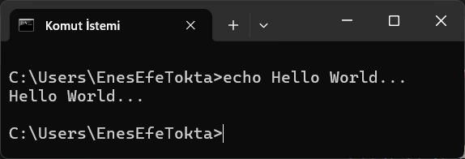

## `schtasks` Komutu 
`schtasks` komutu, Windows işletim sisteminde belirli görevleri otomatik olarak çalıştırmak için kullanılan bir komut satırı aracıdır. Bu görevler, belirli zamanlarda, belirli aralıklarla veya belirli olaylara bağlı olarak tetiklenebilir. Örneğin, bir dosyayı düzenli olarak yedeklemek, bir programı belirli saatte başlatmak veya sisteminizi otomatik olarak kapatmak gibi işlemleri schtasks komutu ile gerçekleştirebilirsiniz.

### `schtasks` Komutunun Farklı Kullanım Şekilleri

* `schtasks`: Bu temel komut, sistemdeki tüm görevleri listeler.
   ```dos
   schtasks
   ```
   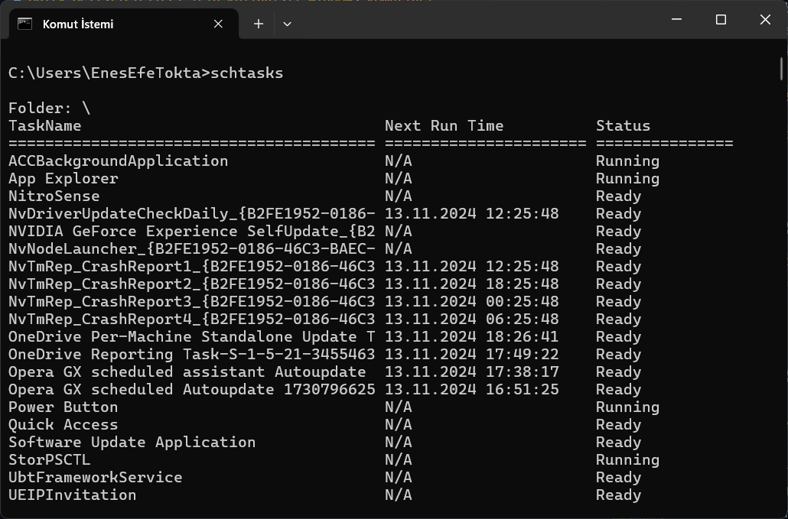

* `schtasks | findstr "Unity"`: "/findstr" parametresi, sistemdeki tüm görevleri listeler ancak sadece "Unity" ifadesi içerenlerin sadece adlarını listeler.
   ```dos
   schtasks | findstr "StartComponentCleanup"
   ```
   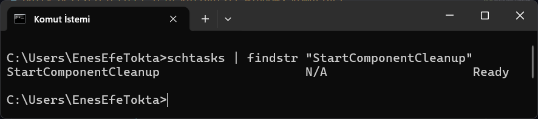

* `schtasks /query`: Bu komut komutu, sistemdeki tüm görevleri listeleri deaylı şeklilde gösterir.
   ```dos
   schtasks /query
   ```
   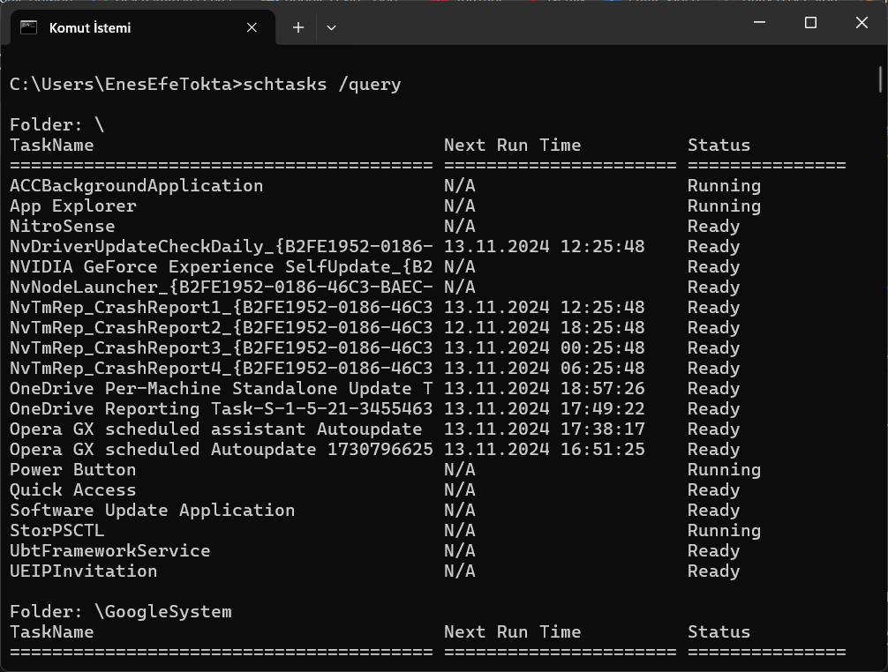

* `schtasks /query /fo csv`: Bu komut, sistemdeki tüm görevleri listeler ve CSV formatında gösterir.
   ```dos
   schtasks /query /fo csv
   ```
   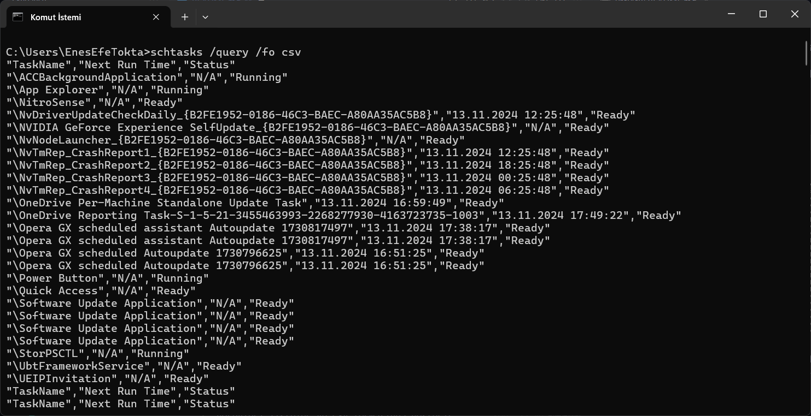

* `schtasks /create /tn "Görev Adı" /tr "Görev Komutu" /sc schedule_type /st start_time /sd start_date` : Bu komut, belirli bir görev oluşturur.
   ```dos
   schtasks /create /tn "Night Backup" /tr "C:\Users\EnesEfeTokta" /sc daily /st 23:00
   ```
   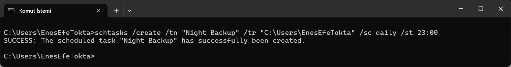

   Bu komut ile pek çok görev oluşturulabilir. Örnek olarak bazı görevler:
   1) `schtasks /create /tn "Haftalık Rapor" /tr "C:\Rapor.bat" /sc weekly /d MON /st 09:00` bu komut ile haftalık olarak bir rapor oluşturulabilir.
   2) `schtasks /create /tn "Gündelik Rapor" /tr "C:\Rapor.bat" /sc once /st 09:00` bu komut ile gündelik olarak bir rapor oluşturulabilir.
   3) `schtasks /create /tn "Cuma Kapatma" /tr "shutdown -s -t 0" /sc weekly /d FRI /st 23:59` bu komut ile Cuma günü 23:59'da sistem kapatılabilir.

* `schtasks /run /tn "Görev Adı"`: Bu komut, belirli bir görevi çalıştırır.
   ```dos
   schtasks /run /tn "Night Backup"
   ```
   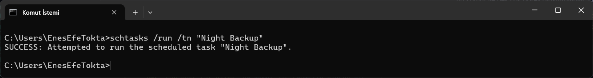

* `schtasks /delete /tn "Görev Adı"`: Bu komut, belirli bir görevi siler.
   ```dos
   schtasks /delete /tn "Night Backup"
   ```
   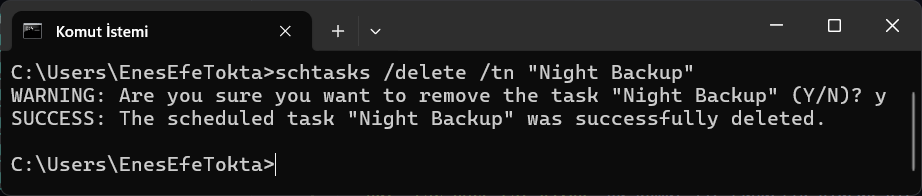

* `schtasks /change /tn "Görev Adı" /tr "Görev Komutu"`: Bu komut, belirli bir görevi değiştirir.
   ```dos
   schtasks /change /tn "Night Backup" /tr "C:\Users\EnesEfeTokta\Rapor.bat"
   ```
   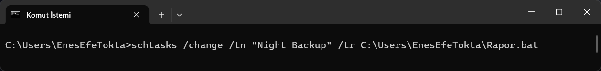

Bu komutlara ek olarak isterseniz görev listenizi "Görev Zamanlayıcı" sayfasından görev ekleme, değiştirme ve silme işlemlerini yapabilirsiniz.

## `exit` Komutu 
`exit` komutu, Windows işletim sistemindeki komutların sonlandırılmasını sağlar ve terminali kapatır.
```dos
exit
```
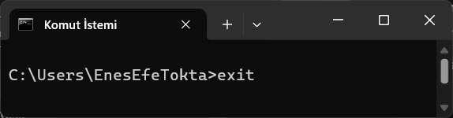

## `for` Komutu 
`for` komutu, bir döngü oluşturmak için kullanılır. `For` komutu iki tane parametre alır. İlk parametre döngüyü oluşturmak için kullanılan ifadeyi, ikinci parametre ise döngüye dahil olan değerleri belirtir. Örneğin, bu örnek bir dizinde ki .txt uzantılı dosyaları taramak için kullanılır.
```dos
for %i in (*.txt) do echo %i
 ```


Bu örnek basit bir ancak `For` ile pek çok şay yapılabiliyor. `For` komutu, herhangi bir dosya veya klasör içindeki dosyaları veya klasörleri tek tek tarayarak istediğiniz işlemleri yapabilirsiniz.

Not: Bu komutların betik dosyasında (.bat veya .cmd) çalıştırılması durumunda % sembolünü %% ile değiştirmek zorunludur.

### Basit `For` Komutu Örnekleri
Bu komutların çalışması için CMD 'yi yönetici olarak açılması gerekli.

* `for %i in ("Hedef_Dizin\*.txt") do copy "%i" "Taşınacak_Dizin"` Bu komut, "Hedef_Dizin\*.txt" klasöründeki tüm.txt uzantılı dosyaları "Taşınacak_Dizin" klasörüne kopyalar.
   ```dos
   for %i in ("C:\Users\EnesEfeTokta\Desktop\*.txt") do copy "%i" "C:\Users\EnesEfeTokta\Desktop\Dizin_adi"
   ```
   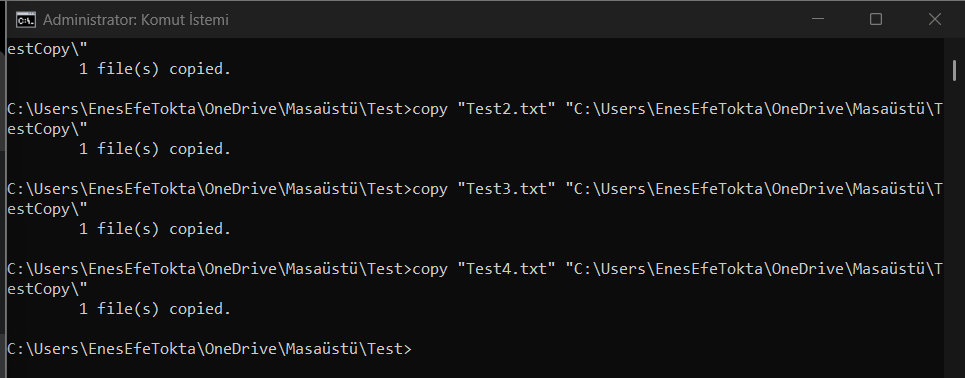

* `for %i in ("C:\Users\EnesEfeTokta\Desktop\*.txt") do move "%i" "C:\Users\EnesEfeTokta\Desktop\Dizin_adi"` Bu komut, "C:\Users\EnesEfeTokta\Desktop\*.txt" klasöründeki tüm .txt uzantılı dosyaları "C:\Users\EnesEfeTokta\Desktop\Dizin_adi" klasörüne taşır.
   ```dos
   for %i in ("C:\Users\EnesEfeTokta\Desktop\*.txt") do move "%i" "C:\Users\EnesEfeTokta\Desktop\Dizin_adi"
   ```
   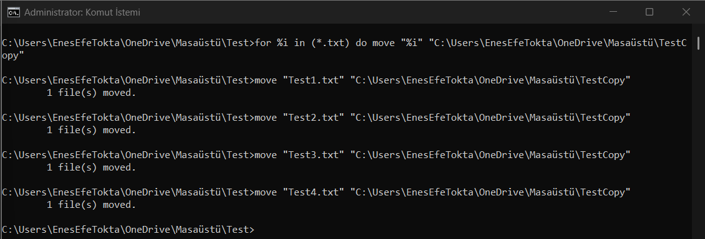

* `for %i in ("C:\Users\EnesEfeTokta\Desktop\*.txt") do del "%i"` Bu komut, "C:\Users\EnesEfeTokta\Desktop\*.txt" klasöründeki tüm.txt uzantılı dosyaları siler.
   ```dos
   for %i in ("C:\Users\EnesEfeTokta\Desktop\*.txt") do del "%i"
   ```
   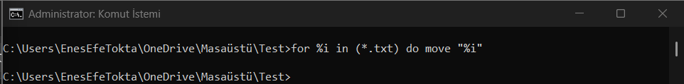

## `diskpart` Komutu 

`diskpart` komutu, Windows işletim sistemlerinde diskleri, bölümleri ve birimleri yönetmek için kullanılan güçlü bir komut satırı aracıdır. Bu araç sayesinde, diskleri oluşturabilir, silebilir, biçimlendirebilir, bölümler oluşturabilir, boyutlandırabilir ve silebilir, sürücü harfleri atayabilir ve daha birçok disk yönetimi işlemini gerçekleştirebilirsiniz.

`diskpart` komutunu Windows işletim sisteminde kullanmak için, CMD'yi yönetici olarak açmak zorunludur anca yönetici olarak açmazsanız komutu çalıştırdığınızda sizden izin isteyecek. İzin verdiğinizde sizi özel bir komut sanıtı ekranına yönlendirecektir. Komut sanıtı ekranında aksi durum yaşanmadığında her satırda ilk `DISKPART>` yazılır.

`diskpart` komutlarını kullanmak için komut satırına `diskpart` yazılır.
```dos
 diskpart
 ```
 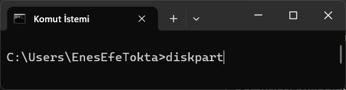

 ### `diskpart` Komutları
 Not: Bu komutlar diskinizde ki verileri değiştirebilir, bozabilir veya geri dönüşü olmaksızın silebilir. Lütfen bu komutu kullanırken dikkatli olunuz.
 * `list disk` : Bu komut, disklerin listesini gösterir.
   ```dos
   list disk
   ```
   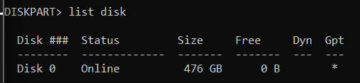

* `select disk x` : Bu komut, disklerin listesinden belirli bir disk seçmesini sağlar. `x` kısmı, seçilecek diskin numarasını belirtir.
   ```dos
   select disk 2
   ```
   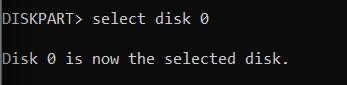

* `list partition` : Bu komut, seçilen diskin bölümlerini listeler.
   ```dos
   list partition
   ```
   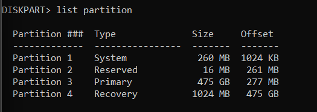

* `create partition primary` : Bu komut, bir diskin bölümlerini oluşturur.
   ```dos
   create partition primary
   ```
   

* `format fs=ntfs quick` : Bu komut, seçilen diskin bölümlerini formatlar. `fs=ntfs` kısmı, bölümün biçimi, `quick` kısmı, bölümün kısa sürede yeniden yapılandırılmasını sağlar. ntfs yerine fat32 gibi farklı dosya sistemleri de seçebilirsiniz
   ```dos
   format fs=ntfs quick
   ```
   

* `assign letter=E` : Bu komut, seçilen diskin bölümlerini sürücü harflerine atar. `letter=E` kısmı, atanan sürücü harfi belirtilir.
   ```dos
   assign letter=E
   ```
   

## Kaynaklar
|Bağlantı Linki|Kaynak|
|:---:|:---:|
| [Medium](https://mirzaleka.medium.com/getting-started-with-windows-command-prompt-5e326f894dd0) |  |
| [Microsoft Learn](https://learn.microsoft.com/en-us/windows-server/administration/windows-commands/windows-commands) |  |
| [YouTube](https://www.youtube.com/watch?v=_km5A8KC5e0) |  |

## İletişim
* [LinkedIn](https://www.linkedin.com/in/enes-efe-tokta/ "Click on Enes Efe Tokta's LikedIn connection link.")
* [GitHub](https://github.com/EnesEfeTokta "Enes Efe Tokta's Github profile.")
* [Email](enesefetokta009@gamil.com  "Click on Enes Efe Tokta's Email.")

## Katkıda Bulunma
1. Bu depoyu forklayın.
2. Kendi özelliğinizi geliştirin (`feature/your-feature-name` dalını oluşturun).
3. Değişikliklerinizi bu repo ile birleştirmek için bir **Pull Request** oluşturun.

## Proje Bilgileri
Bu doküman, Atatürk Üniversitesi Bilişim Sistemleri ve Teknolojileri Bölümü'nde yürütülen İşletim Sistemleri dersi kapsamında hazırlanmış bir akademik çalışmadır. Projenin geliştiricisi Enes Efe Tokta tarafından *6 Kasım 2024* ile *18 Kasım 2024* tarihleri arasında titizlikle hazırlanmış ve dersin ilk ara sınav ödevi olarak sunulmuştur.

Bu çalışma, Windows işletim sistemi komutlarını Unity geliştirme ortamı bağlamında incelemekte ve açıklamaktadır. Doküman, hem akademik hem de pratik amaçlara hizmet etmek üzere tasarlanmıştır.

© 2024 Enes Efe Tokta. Tüm hakları saklıdır. [LICENSE](https://github.com/EnesEfeTokta/Unity-Windows-Commands/blob/main/LICENSE "Click on LICENSE file.")